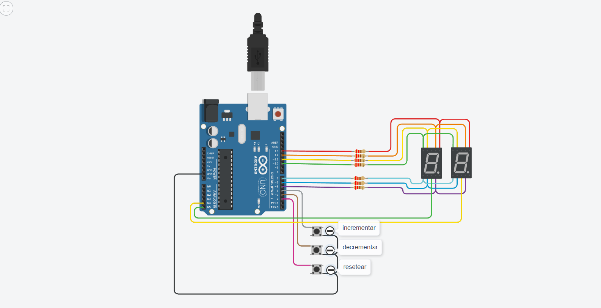

# Ejemplo Documentación 

## Integrantes 
- Oscar Alonso
- Andrés Anguindegui
- Natalia Diez

## Proyecto: Contador de 0 a 99 con Display 7 Segmentos y Multiplexación.

## Descripción
El proyecto consiste en la creación de un contador numérico que permite contar desde 0 hasta 99 de forma ascendente, descendente y reiniciar el valor a 0. La información se muestra en dos displays de 7 segmentos y se controla a través de tres botones.

## Funciones
## encenderSegmento
La función encenderSegmento es una función utilizada para controlar la visualización en un display de 7 segmentos. 
A través de esta función, se pueden encender o apagar segmentos específicos del display, permitiendo mostrar dígitos numéricos.

Parámetros
* "sa" posicion display A.
* "sb" posicion display B.
* "sc" posicion display C.
* "sd" posicion display D.
* "se" posicion display E.
* "sf" posicion display F.
* "sg" posicion display G.

La función toma estos parámetros y utiliza la instrucción digitalWrite para encender o apagar los pines del display de 7 segmentos correspondientes a los segmentos requeridos. Cada segmento está representado por una letra (A, B, C, D, E, F, G), y la función se encarga de establecer el estado de esos segmentos según los valores proporcionados.

~~~ C
void encenderSegmento(int sf, int sa, int sb, int sg, int se, int sd, int sc)
{
  digitalWrite(F, sf);
  digitalWrite(A, sa);
  digitalWrite(B, sb);
  digitalWrite(G, sg);
  digitalWrite(E, se);
  digitalWrite(D, sd);
  digitalWrite(C, sc);
}
~~~

## seleccionarNumero
Esta función toma un número entero como parámetro y configura el estado de los segmentos del display para representar ese número.

Parámetros
* "numero" este parámetro es un número entero que se desea mostrar en el display de 7 segmentos. 
Puede ser un valor del 0 al 9 y se utiliza para seleccionar el número que se mostrará en el display.

La función utiliza una estructura switch para determinar qué configuración de segmentos se debe aplicar para mostrar el número proporcionado.

~~~ C
void seleccionarNumero(int numero)
{
  switch(numero)
  {
    case 0:
        encenderSegmento(1,1,1,0,1,1,1); 
        break;
    case 1: 
        encenderSegmento(0,0,1,0,0,0,1); 
        break;
    case 2: 
        encenderSegmento(0,1,1,1,1,1,0); 
        break;
    case 3: 
        encenderSegmento(0,1,1,1,0,1,1); 
        break;
    case 4: 
        encenderSegmento(1,0,1,1,0,0,1); 
        break;
    case 5: 
        encenderSegmento(1,1,0,1,0,1,1); 
        break;
    case 6: 
        encenderSegmento(1,1,0,1,1,1,1); 
        break;
    case 7: 
      	encenderSegmento(0,1,1,0,0,0,1); 
        break;
    case 8:
        encenderSegmento(1,1,1,1,1,1,1); 
        break;
    case 9: 
        encenderSegmento(1,1,1,1,0,1,1); 
      break;
  }
}
~~~

## encenderDisplay
Esta función establece el encendido de los display, tanto del display de unidad como del de decena.

Parámetros
* "estadoDecena" estado del display de decenas. Puede ser 0 o 1.
* "estadoUnidades" estado del display de unidades. Puede ser 0 o 1.

Esta función muestra los números en los displays de 7 segmentos. Al controlar cuál de los dos displays está encendido en un momento dado, permite la visualización de números de dos dígitos.

~~~ C
void encenderDisplay(int estadoDecena, int estadoUnidades)
{
  digitalWrite(displayDecena, estadoDecena);
  digitalWrite(displayUnidad, estadoUnidades);
}
~~~

## mostrarNumeroEnDisplay
Esta función se encarga de mostrar un número en los display de 7 segmentos.

Parámetros
* "numero" número entero que se desea mostrar en el display de 7 segmentos. Debe ser un número entre 0 y 99.

Divide el número en sus dígitos de decena y unidad, y luego activa los segmentos correspondientes en el display para representar estos dígitos en orden.

# multiplexación

## :robot: Link al proyecto
- [proyecto](https://www.tinkercad.com/things/j40rAgclUkK?sharecode=b2bka0rRlvn-AzD361vmAIcUtyY4SqD0foQZywS3EkY)

---
### Fuentes
- [Consejos para documentar](https://www.sohamkamani.com/how-to-write-good-documentation/#architecture-documentation).

- [Lenguaje Markdown](https://markdown.es/sintaxis-markdown/#linkauto).

- [Markdown Cheatsheet](https://github.com/adam-p/markdown-here/wiki/Markdown-Cheatsheet).

- [Tutorial](https://www.youtube.com/watch?v=oxaH9CFpeEE).

- [Emojis](https://gist.github.com/rxaviers/7360908).

---

